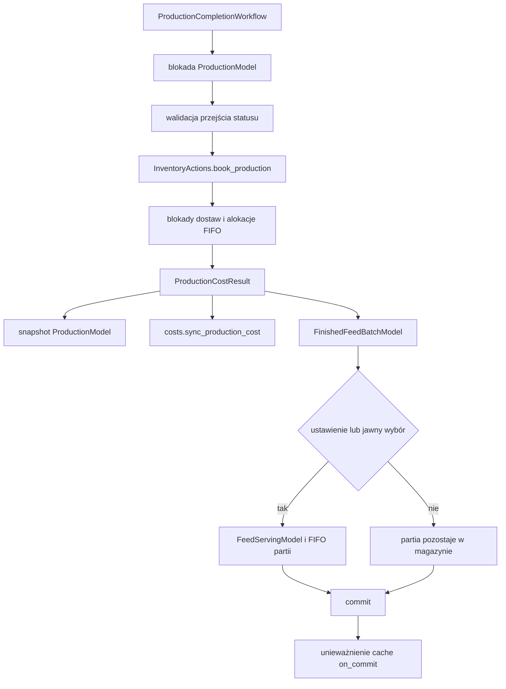

# Architektura managerGospodarstwa

## Granice modułów

Projekt jest modułowym monolitem Django. Aplikacje domenowe udostępniają jawne actions, selectors i services; `farms` koordynuje funkcje gospodarstwa oraz warstwę raportową, ale nie interpretuje tabel pozostałych domen.

| Moduł | Odpowiedzialność | Publiczne operacje i odczyty |
| --- | --- | --- |
| `farms` | gospodarstwo, aktywny kontekst, ustawienia, audyt, import/eksport i agregacja raportów | `get_current_farm`, `get_farm_settings`, `FarmStatisticsService` |
| `feed` | składniki, dostawy, receptury i wersje, produkcja, FIFO składników, produkty i partie gotowej paszy, podania i FIFO partii | `ProductionCompletionWorkflow`, actions w `feed/actions`, selektory i `FeedReportingService`, `InventoryReportingService` |
| `costs` | kategorie i rejestr kosztów ręcznych oraz kosztów generowanych | `sync_production_cost`, `delete_production_cost`, `CostReportingService` |
| `sales` | sprzedaż, pozycje klas, import i parsery dokumentów, statystyki sprzedaży | actions sprzedaży, `SalesReportingService` |
| `sows` | maciory, zdarzenia, stan cyklu, szczepienia i upadki | actions i serwisy cyklu, `MortalityReportingService` |
| `common` | niezależne helpery formatowania, jednostek, zakresów dat, cache i kwantyzacji | `quantize_kg`, `quantize_money`, `quantize_price`, kontrakty cache |

## Mapa modeli

- `farms`: `FarmModel`, `FarmSettingsModel`, `AuditLogModel`, `BackupImportPreviewModel`.
- `feed`: `IngredientModel`, `DeliveryModel`, `IngredientPriceConfigModel`, `RecipeModel`, `RecipeItemModel`, `RecipeVersionModel`, `RecipeVersionItemModel`, `ProductionModel`, `ProductionIngredientUsageModel`, `InventoryMovementModel`, `FeedProductModel`, `ReadyFeedDeliveryModel`, `FinishedFeedBatchModel`, `FeedServingModel`, `FeedServingAllocationModel`.
- `costs`: `CostCategoryModel`, `CostModel`.
- `sales`: `PigSaleModel`, `SaleClassRowModel`.
- `sows`: `SowModel`, `SowEventModel`, `VaccinationPlanModel`, `MortalityReportModel`.

## Przepływ zakończenia produkcji



Całość działa w jednej transakcji. Produkcja jest blokowana przed walidacją, dostawy i partie są blokowane przed alokacją. Ponowne zakończenie nie księguje danych drugi raz. Przewidywalne błędy dziedziczą po `FeedDomainError`; błędy techniczne nie są maskowane i powodują rollback.

Dozwolone zwykłe przejścia to `QUEUED -> STAGE_1_DONE -> COMPLETED`. Pominięcie etapu jest jawną opcją przepływu natychmiastowego. Wymuszenie braków magazynowych jest dostępne właścicielowi gospodarstwa lub administratorowi, zapisuje częściowy koszt, braki i wpis audytu.

## Źródła prawdy ilości i kosztu

- Stan składników wynika z `InventoryMovementModel`; `DeliveryModel.remaining_quantity_kg` jest blokowanym stanem pomocniczym FIFO kontrolowanym przez dokładne alokacje `ProductionIngredientUsageModel`.
- Pierwotnym źródłem kosztu materiałowego produkcji jest suma `ProductionIngredientUsageModel.cost`.
- `ProductionModel.feed_cost_*` jest snapshotem zatwierdzonego wyniku FIFO.
- `CostModel` jest idempotentną projekcją księgową: jeden wpis na produkcję.
- `FinishedFeedBatchModel` przechowuje ten sam zatwierdzony koszt i cenę jednostkową.
- Kwoty i ceny są kwantyzowane wspólnie przez `common.money`.
- Całkowity koszt raportów pochodzi wyłącznie z `CostModel`. Dane produkcyjne nie są dodawane drugi raz; `ProductionCostSelector` wykrywa brak synchronizacji i rozbieżności snapshotów.

Po zatwierdzeniu obowiązuje inwariant:

```text
sum(ProductionIngredientUsageModel.cost)
= ProductionModel.feed_cost_total
= CostModel.amount
= FinishedFeedBatchModel.total_cost
```

oraz `ProductionModel.feed_cost_per_kg = FinishedFeedBatchModel.cost_per_kg`.

## FIFO składników i gotowej paszy

FIFO składników wybiera wycenione dostawy tego samego gospodarstwa z datą nie późniejszą niż produkcja, sortując po `date, id`. Wiersze dostaw są blokowane `select_for_update`; brak ilości przerywa transakcję, a jawne wymuszenie tworzy częściowy wynik bez ujemnego stanu dostawy. Wersja receptury i `custom_recipe_data` mają pierwszeństwo przed aktualnym składem.

FIFO gotowej paszy alokuje `FinishedFeedBatchModel` po `batch_date, id`. Koszt podania jest sumą kosztów `FeedServingAllocationModel`. Usunięcie podania przywraca dokładne ilości do tych samych partii. Relacja `automatic_for_production` zapewnia idempotencję podania automatycznego i odróżnia je od podania ręcznego.

## Produkcja, zakup i podanie

- zakończenie `ProductionModel` zawsze tworzy produkt typu `PRODUCED`, także dla jednej pozycji receptury;
- zakup przez `ReadyFeedDeliveryModel` tworzy produkt typu `PURCHASED_READY`;
- `FinishedFeedBatchModel` wskazuje dokładnie jedno źródło: produkcję albo dostawę gotowej paszy;
- podanie jest osobnym zdarzeniem tworzonym automatycznie dla całej zakończonej produkcji;
- historyczne `FarmSettingsModel.feed_serving_mode` pozostaje wyłącznie dla zgodności danych i importów;
- liczba składników nigdy nie wpływa na typ produktu ani decyzję o podaniu.

## Cofanie, edycja i usuwanie

Zakończonej produkcji nie można edytować zwykłym zapisem modelu ani formularzem. `ProductionSettlementReversalWorkflow` jest jawną, atomową procedurą cofnięcia: wymaga przyczyny, blokuje produkcję, usuwa automatyczne podanie, wycofuje FIFO, projekcję kosztową i partię, cofa status do etapu 1, odbudowuje późniejsze FIFO oraz zapisuje audyt. Usunięcie przechodzi przez `delete_production_with_inventory` i korzysta z tego samego procesu. Relacje księgowe używają `RESTRICT`, więc zbiorcze usunięcie omijające akcję domenową nie skasuje zależności kaskadowo. Jeśli partię wykorzystało inne podanie, cofnięcie i zwykłe usunięcie są blokowane i wymagają osobnej korekty.

`ProductionReconciliationWorkflow` jest jednym miejscem kontrolowanej odbudowy FIFO, snapshotów kosztowych, rejestru kosztów i partii. `InventoryActions.rebuild()` pozostaje wyłącznie kompatybilnym punktem wejścia dla starszych wywołań.

## Raportowanie

`FarmStatisticsService` jest agregatorem kontraktów:

```text
SalesReportingService
CostReportingService
FeedReportingService
InventoryReportingService
MortalityReportingService
        -> FarmStatisticsService -> rentowność, timeline, karty i wykresy
```

Szczegóły tabel, statusów i zapytań pozostają w aplikacji będącej właścicielem danych.

Dashboardy, centrum zadań i wyszukiwanie globalne korzystają z publicznych providerów w `sales`, `costs`, `feed` i `sows`. Providery zwracają gotowe rekordy lub DTO do prezentacji; `farms` nie buduje już zapytań na modelach tych domen. Bezpośrednie importy modeli pozostają świadomie w integracjach pełnego backupu, CSV i generatorach danych testowych, ponieważ te procesy odtwarzają lub tworzą cały graf danych gospodarstwa.

## Izolacja gospodarstw, sygnały i cache

Krytyczne actions i workflow otrzymują `farm` jawnie, a pobrania obiektów filtrują po gospodarstwie. Nie wolno odzyskiwać gospodarstwa z przekazanego identyfikatora w publicznej operacji.

Sygnały nie księgują FIFO, dostaw, kosztu ani partii. Dostawy są synchronizowane jawnie przez actions lub administrację Django; wieloetapowa logika produkcji działa wyłącznie przez workflow. Cache znajduje się w neutralnym `common.cache` i jest unieważniany przez `transaction.on_commit`, więc rollback nie publikuje niezatwierdzonego stanu. `farms.services.cache` jest tymczasowym re-eksportem kompatybilności dla starszych importów.

## Integralność i kompatybilność danych

`FeedIntegrityService` sprawdza zgodność kosztu FIFO, snapshotu produkcji, wpisu kosztowego, kosztu partii, bilansów partii, typów źródła produktu oraz wybranych relacji między gospodarstwami. Domyślnie działa tylko do odczytu. Naprawy wymagają jawnego `apply=True`; konflikty produktu używanego jednocześnie przez zakup i produkcję są raportowane, ale nigdy automatycznie zgadywane. Interfejsem operacyjnym jest polecenie `audit_feed_integrity --farm-id ...`, opcjonalnie z `--apply`.

Kopie gospodarstwa mają wersję 3. Import obsługuje wersje 1–3: brakujące sekcje nowych, opcjonalnych danych są traktowane jako puste, a brakujące pola opcjonalne korzystają z domyślnych wartości modelu lub `NULL`. Brak wymaganego identyfikatora relacji albo pola biznesowego przerywa cały import przed zapisem. Kopia obejmuje również zgłoszenia upadków. Nieobsługiwana przyszła wersja jest odrzucana zamiast interpretowana heurystycznie.

## Audyt zależności przed refaktoryzacją

Przed zmianą `farms.services.statistics` importował bezpośrednio `CostModel`, `PigSaleModel`, `ProductionModel`, `DeliveryModel` i `MortalityReportModel`; obecnie zależy od publicznych serwisów raportowych. Dashboardy i wyszukiwanie miały analogiczne zależności, które zastąpiono providerami domenowymi. `feed.actions.inventory` wywołuje publiczny kontrakt `costs.actions` w ramach wspólnej transakcji. Importy/backupy w `farms` pozostają świadomą warstwą integracyjną, ponieważ odtwarzają komplet danych gospodarstwa. Wykryte powielenia kwantyzacji przeniesiono do `common.money`, cache do `common.cache`, a domyślną ilość produkcji do domeny `feed`.
